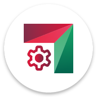

[![RuStore](https://img.shields.io/badge/RuStore-logo?style=for-the-badge&logo=data:image/svg+xml;base64,PD94bWwgdmVyc2lvbj0iMS4wIiBlbmNvZGluZz0iVVRGLTgiPz4KPHN2ZyBpZD0iX9Ch0LvQvtC5XzIiIGRhdGEtbmFtZT0i0KHQu9C+0LkgMiIgeG1sbnM9Imh0dHA6Ly93d3cudzMub3JnLzIwMDAvc3ZnIiB2aWV3Qm94PSIwIDAgMjMuNzkgMjIuMzEiPgogIDxkZWZzPgogICAgPHN0eWxlPgogICAgICAuY2xzLTEgewogICAgICAgIGZpbGw6ICNmZmY7CiAgICAgICAgZmlsbC1ydWxlOiBldmVub2RkOwogICAgICAgIHN0cm9rZS13aWR0aDogMHB4OwogICAgICB9CiAgICA8L3N0eWxlPgogIDwvZGVmcz4KICA8ZyBpZD0iX9Ch0LvQvtC5XzEtMiIgZGF0YS1uYW1lPSLQodC70L7QuSAxIj4KICAgIDxwYXRoIGNsYXNzPSJjbHMtMSIgZD0iTTIxLjYzLDE2Ljk3bC0yLjQyLS42Yy0uMjktLjA4LS41LS4zNC0uNTEtLjY0bC0uMy04Ljc4Yy0uMDktMS4xNi0uOTYtMi4wOS0xLjg4LTIuMzYtLjA1LS4wMi0uMTEsMC0uMTQuMDUtLjAzLjA0LS4wMi4xMS4wMi4xNC4yMy4xNy44NS43My44NSwxLjd2MTEuNDdjMCwxLjExLTEuMDYsMS45Mi0yLjE2LDEuNjVsLTIuNDYtLjZjLS4yNy0uMDktLjQ2LS4zNC0uNDctLjYzbC0uMy04Ljc4Yy0uMDktMS4xNi0uOTYtMi4wOS0xLjg4LTIuMzYtLjA1LS4wMi0uMTEsMC0uMTQuMDUtLjAzLjA0LS4wMi4xMS4wMi4xNC4yMy4xNy44NS43My44NSwxLjd2OS41NnMwLDAsMCwwdjEuOTFjMCwxLjExLTEuMDYsMS45Mi0yLjE2LDEuNjVsLTYuOTQtMS43MWMtLjk2LS4yNC0xLjY0LTEuMDktMS42NC0yLjA2VjYuOTljMC0xLjExLDEuMDYtMS45MiwyLjE2LTEuNjVsNC4zNywxLjA4di0yLjA3YzAtMS4xMSwxLjA2LTEuOTIsMi4xNi0xLjY1bDQuMzcsMS4wOFYxLjdjMC0xLjExLDEuMDYtMS45MiwyLjE2LTEuNjVsNi45NCwxLjcxYy45Ni4yNCwxLjY0LDEuMDksMS42NCwyLjA2djExLjQ5YzAsMS4xMS0xLjA2LDEuOTItMi4xNiwxLjY1WiIvPgogIDwvZz4KPC9zdmc+&logoColor=%230073f7&color=%230073f7&link=https%3A%2F%2Fplay.google.com%2Fstore%2Fapps%2Fdetails%3Fid%3Dcom.dertefter.ficus)](https://apps.rustore.ru/app/com.dertefter.ficus)

# NETI Клиент

NETI Клиент - это неофициальное приложение для студентов НГТУ (НЭТИ), созданное студентами этого учебного заведения!

## Функционал приложения
Расписание занятий и расписание сессии
+ Результаты сессии (Зачётка)
+ Сообщения от преподавателей и служб
+ Новостная лента университета
+ Интеграция с DiSpace (курсы, диалоги)
+ Информация о стипендиях и выплатах
+ Расписание преподавателей
+ Запись в бюро пропусков
+ Поделиться успеваемостью
+ Виджет с расписанием занятий
+ Поддержка Material You (Для Android 12+ )
+ Поддержка Wear OS ⌚